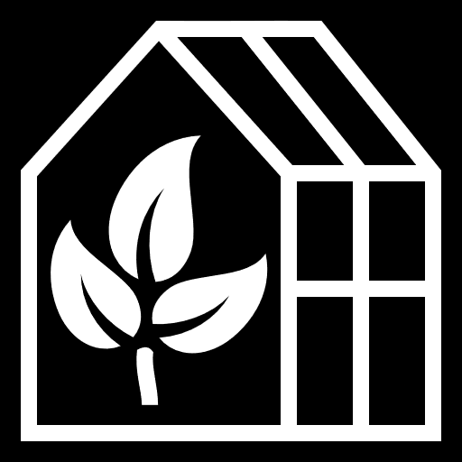
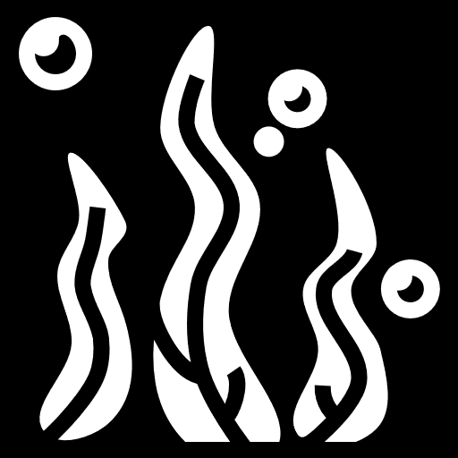
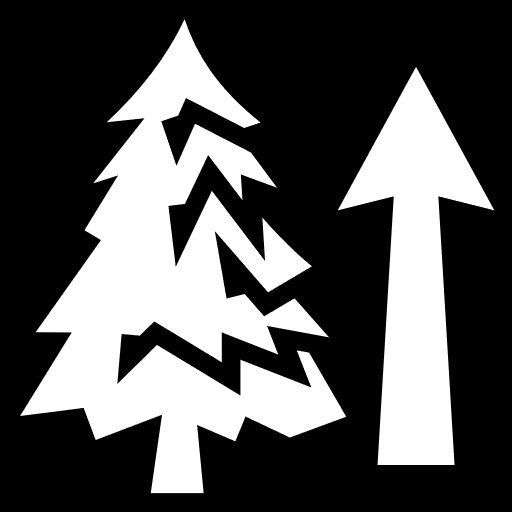
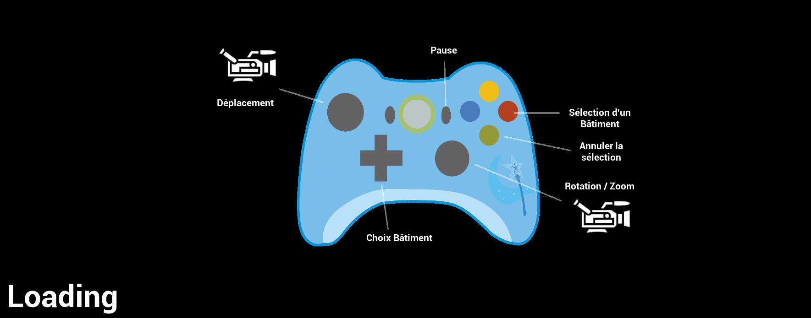

<h1 align="center">KORRIGAN</h1>

	

## Synopsis

Korrigan est un jeu de stratégie consistant à réhabiliter une zone contaminée, polluée, invivable et dangereuse avec des petites créatures issues de la forêt appelées korrigans. Pour cela, les petites créatures installent des infrastructures plus ou moins complexes afin d'améliorer la situation de la zone. L'objectif est de rendre l'espace le plus vivable possible en 10 minutes. Le nombre de petites créatures étant limité, il n'est pas possible de construire beaucoup de bâtiments en même temps et il est nécessaire d'attendre d'avoir plus de créatures afin de construire les complexes les plus avancés.

## Plantes (bâtiments)

    
    Épurateur d'Air
    
    Plante Piranha
    
    Filtre

    
    Hôpital Végétal
    
    Champ de tournesol
    
    Plante Piranha flottante 

    
    Jardin Botanique

## Gameplay

<video controls>
    <source src="ReadmeResources/GameplayKorrigan.mp4" type="video/mp4">
</video>

## Explications

    

On peut voir sur l’image qu’il y a trois barres : 

La plus haute correspond à la dépollution des eaux et des sols. Pour la faire réduire il faut poser ces bâtiments :

    
    Filtre
    
    Jardin Botanique

Celle du milieu correspond à la pollution causée par les déchets. Pour la réduire, il faut poser ces bâtiments : 

    
    Plante Piranha
    
    Plante Piranha flottante 

La dernière correspond à la pollution atmosphérique. Pour la réduire, il faut utiliser ce bâtiment : 

    
    Épurateur d'Air

## Controles

    

